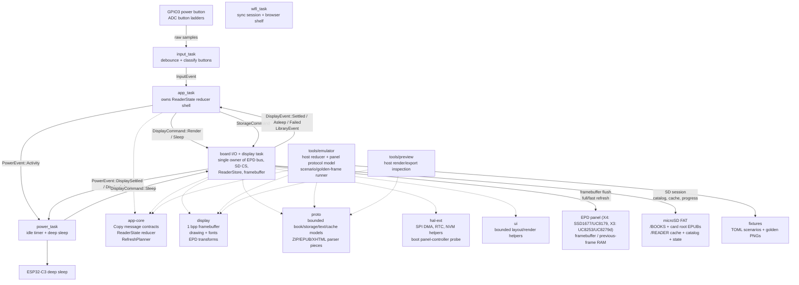

# CalendulaOS architecture

This firmware is a bare-metal Rust reader OS for the Xteink X4 and X3 e-ink
readers: ESP32-C3, monochrome e-paper panels, no PSRAM.

The design goal is not to imitate a desktop OS. It is a small data pipeline:

```text
buttons -> app state -> display command -> framebuffer -> EPD panel RAM -> refresh -> sleep
```

## Current architecture diagram



## Rules

- `#![no_std]`, no heap allocation in the reading path. The one
  exception is the Wi-Fi sync session, which donates loaned buffers to
  esp-alloc and ends in a reset (see "Wi-Fi sync session").
- Two framebuffer allocations: active drawing buffer in main DRAM, previous-frame
  buffer in DRAM2. Each is 48,000 pixel bytes on X4 (800×480) or 52,272 on X3
  (792×528), 1 bpp.
- Display ownership is single-writer: only `display_task` touches the EPD bus —
  except on the board-identity refusal path, where `board_guard`'s refuse task
  owns it because `display_task` is never spawned. One writer either way,
  never two (see Board identity guard).
- Reader state ownership is single-writer: only `app_task` mutates page/menu state.
- Messages are small `Copy` values. Bulk bytes stay in caller-owned buffers.
- Power requests display sleep through `display_task`; it never touches SPI.
- Hardware assumptions live in one of two places:
  - Board wiring in `fw/src/main.rs` and `fw/src/tasks/input.rs`.
  - Controller protocol in `display/src/epd/`.

## Workspace

```text
app-core/ app state reducer and Copy message contracts shared by firmware/tools
display/   framebuffer, drawing primitives, EPD controller constants and address math
hal-ext/   thin async wrappers over ESP HAL peripherals, plus the boot
           panel-controller probe's pin/timing half
fw/        boot, Embassy executor, task wiring, board-owned peripherals
ui/        shared shell rendering plus ui::reading, the reader page-plan seam
           (page bounds, ink measurement, wrapping) used by fw and host tools
proto/     bounded book/storage/text/cache models plus ZIP/EPUB/XHTML parser pieces
tools/emulator/ host-side development emulator and scenario runner
tools/cargo.sh  rustup-stable Cargo wrapper for firmware builds/checks
tools/bench/    serial bench harness for hardware timing, storage/cache,
                sleep, soak, and host channel-stress checks
```

## Embassy tasks

```text
app_task
  owns ReaderState
  InputEvent -> DisplayCommand::Render
  modes: Home, Library, Reading, Chapters, Sync, Settings

board_io/display task
  owns EpdBus, SD CS, ReaderStore, and Framebuffer
  DisplayCommand::Render -> pure framebuffer render from the current ReaderStore snapshot
  StorageCommand::* -> serialized SD/FAT/catalog/cache work on the shared SPI bus
  DisplayCommand::Sleep -> sleep screen full refresh -> EPD controller deep sleep -> PowerEvent::DisplayAsleep
  sends DisplayEvent::Settled (or RefreshFailed) to app_task when render completes

input_task
  polls GPIO3 and ADC ladders
  debounced ADC/power edges -> reader Button actions -> InputEvent
  owns GPIO3 until the deep-sleep path asks for it: a WAKE_PIN_REQUESTS ping
  stops the polling and surrenders the Input over WAKE_PIN_HANDOFF

power_task
  observes activity and display-settled events
  asks display_task to sleep the EPD controller, then enters ESP32-C3 deep sleep
  takes GPIO3 off input_task before arming it as the wake source, so the pin
  has a single owner when it is re-materialised

board_guard refuse task
  spawned INSTEAD of every task above, and only when the boot-time board probe
  confirms this image is running on the other board (see Board identity guard)
  owns EpdBus and SD CS outright, since no display task exists on this path
  attempts /BOARDID.TXT, reports on serial whether it landed, then parks
  forever; never touches the panel, because a mismatched image cannot drive it
  (see Board identity guard)

wifi_task
  parked until SyncCommand::Start arrives from the Wireless screen
  requests StorageCommand::LoanSyncMemory, receives the dismantled EPUB
  scratch as radio heap, joins Wi-Fi in STA mode, reports SyncEvents to
  app_task, then serves the browser shelf page at the device's LAN address
  SyncCommand::Exit (the done press) ends the session with a software reset
```

## Wireless session

The wireless session is one-way and modal because the radio blob needs ~100 KB of
heap this firmware does not have while reading. `fw::sync_mem` owns the
plumbing: the display task dismantles the EPUB scratch into raw regions
(`reader_cache::dismantle_scratch`), and the wifi task donates them to
esp-alloc. dram2 (the boot-loader shadow segment) no longer contributes a
radio-heap share: it holds only the previous-frame framebuffer, packed
against its top, and every byte underneath belongs to the main stack —
`fw/build.rs` raises `_stack_start` over the freed bytes and asserts the
reader's 27 KB deep-call floor. The radio makes do with the scratch
regions alone, sized for the upload workload by the `ControllerConfig` in
`tasks/wifi.rs`; heap slack is logged at join and after each upload so
that budget stays observable. The smaller scratch buffers are reused
directly as TCP socket and HTTP buffers. Once loaned, the reader pipeline cannot come back: leaving
the Wireless screen after the radio ran maps to `SyncCommand::Exit`, which is
a software reset; boot restore then reloads the saved position.

Before the loan the display task flushes any coalesced reading position
to durable state, because the session's only exit is the reset; a failed
flush refuses the loan rather than dismantling the scratch over an unsaved
position. The refusal is an answer, not a silence: `SYNC_LOANS` carries
`Result<SyncLoan, SyncError>`, the wifi task reports `SyncError::Storage`
to the Wireless screen and re-parks for the next Start, and Confirm
retries the session (nothing was loaned, so no reset is needed and the
position write is retried first). (An earlier
iteration also exchanged the position with a kosync server here; that
shipped unused and was removed — the session is purely a book server.)

Once joined, the wifi task serves a shelf page at the device's LAN
address (the Wireless screen's `Serving` status hands out the URL, with
Confirm as the done key). The
page lists the catalog, shows real upload progress, and offers per-book
removal. Routes: `GET /` serves the page, `GET /list` returns the catalog
snapshot shipped with the loan, `POST /upload?name=` streams raw EPUB
bytes, and `POST /delete?name=` removes a book (card-root entries carry
`root=1`; uploads always land in /BOOKS). Upload bytes reach the display
task — still the single SD owner — through `fw::upload`'s two-buffer
ping-pong: 4 KB chunks carry loaned buffers one way and the buffers come
back on a return channel once written. The display task holds one
interruptible SD session for the upload phase.

Bytes stream into `/READER/UPLOAD` under an opaque name with no long name,
so nothing enters the library namespace until the file is complete and an
interrupted upload leaves only a scratch file. Installing it is a
same-volume move: directory entries are rewritten and the cluster chain is
left alone, so the book arrives in `/BOOKS` under its real filename as a
VFAT long name (FAT also requires an 8.3 alias, which the driver derives;
the catalog scan accepts `.epu` alongside `.epub` and opens books by that
alias). The card is therefore organizable on a computer. Whatever held the
name is parked in `/READER/ROLLBACK` until the install completes, and
reclaimed only then.

One `/READER/INSTALL.JNL` record describes the whole transaction. It is
written before anything is touched and cleared when everything is done,
never updated in between. Recovery replays it before the library is scanned
or a cached catalog is trusted, and while an unresolved record stands it
owns the names it describes: further uploads *and* deletes are refused
until it clears. Books uploaded before long-name support are recognized by
their `/READER/LABELS/<stem>.ID` identity sidecar and migrated by the same
transaction rather than duplicated; those sidecars are still read for such
books, but no longer written.

The cache root is `/READER`, named for the reader rather than for a board,
since the same firmware runs on more than one vendor's hardware. It was
`/XTEINK` until then, and nothing in the firmware knows that: renaming the
directory from a computer carries the catalog, the caches, the reading
position, the Wi-Fi credentials, the fonts and any unresolved install
journal across together, so the layout has one name and one set of rules
rather than a compatibility path kept alive for cards that have already
moved.

Power/idle sleep and the done press abandon an active writer (the scratch
file's FAT chain is reclaimed, the shelf untouched), close the SD session,
and only then sleep or reset; the done press waits for the stop
acknowledgement so the reset never races an open FAT writer. The boot
rescan then surfaces the new books.

Station credentials come from `/READER/WIFI.BIN` (written by the
onboarding portal below), falling back to compile-time `option_env!`
values (`CALENDULA_WIFI_SSID`/`CALENDULA_WIFI_PASS`) for dev builds.
At boot the display task reads WIFI.BIN once and reports the saved
network's name as `SyncEvent::NetworkSaved`, so the Wireless screen can
show which network is saved and offer connect/forget honestly instead of
guessing from build flags. Forget is a two-press flow (the browse key
arms it, Confirm deletes WIFI.BIN via
`StorageCommand::ForgetWifiCredentials`) and is only reachable while the
radio is untouched; it drops the screen back to the set-up offer — the
recovery path for a wrong password or a changed router that used to
require editing the card on a computer.

With no credentials anywhere, starting a session raises the onboarding portal
instead: a WPA2 hotspot (`CALENDULA-XXXXXX`, the last six hex digits of this
device's MAC, so the name on screen picks out one entry in a Wi-Fi list. Two
devices whose addresses come from one IEEE allocation block cannot share it;
between blocks it discriminates rather than guarantees)
at 192.168.4.1 with a captive DHCP
server, a DNS catch-all (every name resolves to the portal, which makes
phones raise their sign-in sheet unprompted), and a credential form on
port 80. The hotspot's WPA2 PSK is minted per session from the hardware
RNG when the portal starts — the form's plaintext POST is at least
encrypted over RF, and because the PSK exists only in that session's
RAM, nothing secret lives in the repo or is extractable from a release
binary. It rides `SyncEvent::PortalUp` to the Wireless screen, which
encodes the join QR at render time (`ui/src/join_qr.rs`, Nayuki's
no-heap qrcodegen) and prints the password beside it for phones that
cannot scan; the display is the PSK's only channel (supporting both
QR scanning and manual password entry), so the on-screen credentials
and beacon cannot drift. Submitted credentials travel to the display
task as a `StoreWifiCredentials` Copy message, land in WIFI.BIN, and the
next session joins as a station. `proto::captive` holds the sans-IO
DHCP/DNS/HTTP codecs under host tests; the wifi task only owns sockets.

Embassy is used for cooperative waits: ADC retry delays, button polling, SPI DMA
transfers, BUSY waits, and sleep windows all yield instead of spinning. The real
battery win comes after display settle: the power task asks the display task to
draw a visible sleep screen, power down the EPD controller, then move the ESP32-C3 into
deep sleep. The power button also requests this same sleep path instead of being
treated as ordinary navigation input.

Input/render backpressure is intentionally coalesced. The app keeps at most one
display render in flight. While the display is refreshing, new button events
still update `ReaderState`, but they set a single pending-render flag instead of
queuing stale framebuffer renders. When `DisplayEvent::Settled` or
`RefreshFailed` arrives, the app renders the latest state once.

Storage is also explicit. Files/Home/Reading transitions enqueue
`StorageCommand`s after the visible render settles; render commands never scan
FAT, open EPUBs, build caches, or write progress. Open/extend requests whose
page already sits inside the loaded section window are answered from RAM without
an SD session or a redundant display render, and reading-progress writes are coalesced (at most one
alternating STATEA/STATEB generation per 15 s, flushed before display
sleep, with sleep deferred if the flush fails). The board I/O task is still
the single SPI owner, so display refresh and SD transactions cannot overlap, but
the user-facing view is always drawn from the latest already-owned snapshot.
SD/FAT access goes through an SD session: the board I/O task deselects the
display, clocks the bus down for the card (400 kHz identification with wake
clocks, then 25 MHz data), opens the FAT root, performs one storage action, and
restores the panel's display SPI clock before returning to EPD work. The card stays powered
between sessions while the device is awake, so only the first session runs the
full CMD0/ACMD41 init; later ones reuse the remembered card type and skip the
handshake, falling back to a cold init if a reused session cannot open the
volume. Deep sleep resets the chip and clears that state.

## Board identity guard

Geometry is a compile-time choice (see Display model below), so an X3 image and
an X4 image are different binaries for the same ESP32-C3. Nothing in the boot
chain separates them: the image header's chip id catches an ESP32-S3 image but
not a sibling-board one, so a wrong-board flash boots and then drives the wrong
panel controller at the wrong geometry. `proto::ota` already refuses a
wrong-board *update* by comparing descriptor identities; the guard closes the
same hole on an initial flash.

```text
esp_hal::init
  -> deep-sleep wake?  yes: skip everything below, boot on
  -> hal_ext::board_probe::fingerprint(I2C0, sda GPIO20, scl GPIO0)
       two read-only address sweeps for the X3-only I2C parts
       (BQ27220 0x55, DS3231 0x68, QMI8658 0x6B/0x6A); the X4 has none
       both pins handed back as inputs before anything else claims them
  -> BoardVerdict::{X3Confirmed, X4Confirmed, Inconclusive}
  -> fw::board_guard::evaluate(verdict, PROJECT_NAME)
       compares against proto::ota::identity_board(this image's identity)
  -> Some(mismatch): spawn ONLY fw::board_guard::refuse and halt
     None:           normal bring-up
```

Rules that make the guard safer than the failure it replaces:

- **Only a confirmed mismatch refuses.** X3 needs at least two of the *same*
  peripherals answering in both passes — the intersection of the two masks, not
  two independent counts, so that two different pairs of spurious ACKs
  (`0b011` then `0b110`) cannot add up to a board. X4 needs a clean, unfaulted
  nothing in both. Passes that disagree, a single stray ACK, or a bus that timed
  out rather than answering are all `Inconclusive` and boot normally — a flaky
  probe must never brick a correctly flashed device. The truth table, including
  the disagreeing-pairs case, is pinned by const assertions in `board_probe`.
- **The message never depends on the panel.** A mismatched image has the wrong
  controller driver compiled in, so the refusal *attempts* `/BOARDID.TXT` — the
  detected board, the firmware's board, and the release asset to flash instead —
  and never touches the panel. The card is the channel a user without a serial
  cable can reach, not a guaranteed one: `write_diagnostic` reports whether
  every write and the close landed, and an absent, full, or unreadable card
  leaves no file. The refusal is therefore *always* emitted on serial first
  (`board: REFUSING TO BOOT …`, then the card's outcome as one of
  `board: wrote /BOARDID.TXT`, `could not write`, or `no SD card for
  diagnostic`), so the two channels together degrade rather than fail. An
  on-screen version
  was built and then removed on the evidence: measured on an X3 running the X4
  build, `init_panel` fails with `Busy(TimedOut)` after 15 s and draws nothing,
  because the two controllers read BUSY in opposite senses and the SSD1677
  driver's wait for a falling edge never fires. It was a quarter-minute stall
  and a framebuffer render in exchange for a blank screen. Worth restoring only
  for a future board pair that shares a controller.
- **The wake path pays nothing.** A deep-sleep wake skips the probe and the
  guard outright: it is the same power-on continuing, the board cannot have
  changed, and the boot that armed the sleep already passed. Only a cold boot
  probes — which is every boot that follows a flash, since flashing ends in a
  reset rather than a wake. No cached verdict is involved, so there is no
  stored state a halt decision could rest on.
- **It halts rather than resets.** A boot loop looks identical to a dead device
  and would rewrite the diagnostic endlessly. The recovery combo (Back + Up)
  still runs before the guard, so the slot-0 anchor remains reachable.
- **C3 only.** The probe pins are the battery divider and U0RXD on the ESP32-C3
  but native USB D+ and a strapping pin on an ESP32-S3, so the pin-touching half
  of `board_probe` is compiled out off RISC-V rather than guarded at runtime.

The clean-absence half of that rule has been exercised on hardware too, by
substitution rather than by an X4: an X3 running a build whose probe table
points at unpopulated addresses answers `found=0b0/0b0 fault=false/false ->
X4Confirmed` in 5 ms, and then refuses in the *other* direction ("detected
Xteink X4, firmware built for Xteink X3", naming `firmware-x4.bin`). So the
found-nothing branch, the absence of phantom ACKs on a bare address set, and
both directions of the mismatch message are all covered. What no X3 can cover
is the X4's GPIO0 battery divider under the probe's open-drain pull-up; if that
misbehaves it yields a faulted pass, which is `Inconclusive` and a normal boot.

Measured on an X3 (2026-08-06): the probe answers `X3Confirmed` with all three
parts found in both passes (`found=0b111/0b111`) in **6 ms**, and costs **+9 ms**
to the pre-task boot stage — `display: started` moves 816 → 825 ms — of which
6 ms is the probe and the rest its two always-on log lines. Boot-to-first-paint
lands at 3001–3075 ms across repeat boots of the same image, a spread wider than
the change itself, so the added cost is not visible in first paint. The BQ27220
reads normally afterward (`input: battery seeded (4309 mV, 99%)`), confirming
the probe leaves the gauge and the pins as it found them.

A single unified X3/X4 binary would remove the problem instead of guarding it,
and is deliberately not the answer here: statically sized framebuffers would
have to be sized for the larger panel, costing the X4 ~8.5 KB of main stack
against a 27 KB floor, and the byte-run rasterizer and portrait glyph transpose
are both specialized against constant dimensions.

## Display model

`display::fb::Framebuffer` is the source of truth. White is bit `1`, black is
bit `0`, row-major.

Geometry and fast-refresh timing depend on the board:

- **X4**: SSD1677, 100-byte rows, ~421 ms fast waveform.
- **X3**: UC8253, 99-byte rows, ~307 ms fast waveform (down from 379 ms via CDI interval tuning).

### Which controller is on the bus

The board is a compile-time choice; the controller on it is not entirely. Newer
production runs of both devices swap the panel controller for an UltraChip
sibling that shares the UC81xx KW-mode command set — the X3's UC8253 for a
UC8279d, the X4's SSD1677 for a UC8179 — behind identical glass, pinout and
packaging. Nothing outside the device says which one a unit carries.

So boot asks the silicon. Before SPI2 is configured, `fw::main` bit-bangs a
VER (`0x70`) / FLG (`0x71`) read on the panel's own pins through
`hal_ext::epd_probe`; only a UC81xx returns a structured version block.
`display::epd::probe` — sans-IO, and the only part with host tests, since no
sibling hardware exists to bench — turns the bytes into a verdict under three
rules that a datasheet reading would not produce:

1. **Two passes that agree**, never one read. A floating bus can produce one
   plausible answer, not the same non-trivial answer twice. A single stray
   match is `Inconclusive`.
2. **FLG must be driven** — not `0x00`, not `0xFF`, and `BUSY_N` set.
3. **The MTP key rescues a blank VER.** Field UC8279d units answer VER with
   `FF FF FF FF FF`, which rule 2 rejects; the RMTP (`0xA2`) dump opening with
   the `0xA5` refresh-enable key is the positive evidence that recovers them.

Rule 3 is the load-bearing one, and the bench says so. A shipping UC8253 X3
answers the probe with `VER = FF FF FF FF FF` and a genuinely driven
`FLG = 0x13` — byte for byte the field UC8279d signature, clearing every gate
except the last. Its MTP reads all `FF`, and that absence is the only thing
that keeps it on the UC8253 driver. The `0xA5` check is not belt-and-braces;
without it this firmware misidentifies the installed base.

The read never gates on BUSY: which controller is present is the unknown, so
its BUSY polarity is too (SSD1677 active-high, UC8253 two-phase and idle-high).
A flat post-reset delay covers either. The OEM's NVS `hw_calib/screenType` is
*not* consulted — a full-flash from another unit overwrites that namespace, so
it can name the wrong panel; the live bus is ground truth.

`fw::display_flush` stores the verdict in an `AtomicU8` and routes `init_panel`,
`flush`, `prestage_previous` and `sleep_panel` through it. Only the default
backends exist today, so a confirmed sibling still runs them; the UC8179 and
UC8279 backends plug into that dispatch when they land.

A live probe costs ~70 ms on the X4 and ~200 ms on the X3, whose UC8279d is not
bench-proven to answer the short reset pulse and so retries a missed screening
pass at the vendor's 50 ms identification timing. The X3 also pays a second
vendor-timing pulse for its confirming pass, because a UC8253 presents the
blank-VER shape and that shape has to be settled by an MTP read taken on a bus
the part could actually have answered. It answers a question about
soldered hardware, so the scope of one probe is one *power cycle*, not one
boot: `fw::probe_cache` retains the result in RTC fast RAM beside
`sleep_marker`'s, and a deep-sleep wake, an OTA reset, or a crash reboot reuses
it and pays nothing.

RTC RAM is the store precisely because it is volatile. Flash, NVS and the SD
card all survive being copied onto another unit — the failure mode that makes
the OEM's `hw_calib/screenType` untrustworthy — so a verdict cached there can
outlive the hardware it describes. This one cannot: it is zeroed on first
power-on, which is also the earliest moment the panel could have changed. A
magic word and a rejected-on-unknown verdict byte keep brownout garbage from
decoding as a cache.

The section is 64 bytes with `sleep_marker` sitting in the middle of the
probe cache's two statics, which is how retention across deep sleep is
witnessed rather than assumed: a wake that renders as one quick flicker
instead of a multi-flash full refresh means `SLEEP_IMAGE` came back holding
what the sleep handshake wrote, and the bytes on either side of it cannot have
been treated differently. *Bench note:* a software reset now reuses the
verdict; re-running the probe takes a power cycle, and `main` logs which path
it took.

The verdict, the raw VER/FLG bytes and the MTP header are written to
`/READER/PROBE.TXT` on every boot, so a locked unit with no serial console is
still diagnosable.

The full refresh (the only mode that reliably clears unknown pixels) and normal
page turns differ by controller:

- **X4 (SSD1677)**: The first refresh writes the current frame to both BW and
  RED RAM, then runs the multi-flash full waveform (~3.5 s). Normal turns write
  the current frame to BW RAM with the retained previous frame in RED RAM, then
  trigger the fast waveform.
- **X3 (UC8253)**: The full plan writes white to DTM1 and the current frame to
  DTM2, runs the full refresh, then stages the current frame into DTM1 and runs
  a fast settle pass. Normal turns write the current frame to DTM2; the previous
  frame is only written to DTM1 if it was not already staged.

`RefreshMode::FastClean` sits between those — a one-flicker clean:

- **X4 (SSD1677)**: Runs display-mode-1 with the temperature register forced to
  90 °C, selecting the hotter OTP LUT (~1.5 s, small contrast cost). The sensed
  temperature is restored afterward.
- **X3 (UC8253)**: Uploads the firmware-defined `HALF` LUT bank in absolute CDI
  mode — a similar short clean without temperature overrides.

The X3's clean plans also owe the panel 200 ms of quiet before its RAM is
written again. Nothing in the plan follows that interval, so it rides on
`FlushPlan::settle_after_ms` instead of being the flush's last step, and the
caller holds it: the display task reports the frame, waits, then prestages,
which is the write the interval guards. The gap is unchanged, only which side
of `DisplayEvent::Settled` it falls on, and that takes it off press-to-settled
on every view change, wake and menu step. A plan is therefore not finished when
its steps are, and a caller that drops the interval rather than deferring it is
the one way to get this wrong: the emulator's panel model refuses a RAM write
while an unheld settle stands, and in firmware the returned `PanelSettle` is a
bound variable, so deleting the wait fails the build. Neither guard reaches the
other's call site.

Waking from the sleep screen and view/context changes use `FastClean`
instead of the full waveform, since the panel's contents are known.

`RefreshPolicy` in Settings: `FastOnly`, `FullOnWake` (default), or
`FullEveryTen` (legacy name — actually every eight fast refreshes).

`display::epd` contains transform constants validated during bring-up:

- **X4 (SSD1677)**: `MIRROR_X = true`, `MIRROR_Y = false`, and `REVERSE_BITS = true`.
  (`MIRROR_Y = true` was tested and rejected because it made glyphs vertically
  mirrored/upside down.)
- **X3 (UC8253)**: `MIRROR_X = true`, `MIRROR_Y = true`, and `REVERSE_BITS = true`.

The logical framebuffer API stays upright; firmware and host tools remap
bytes/bits before panel-RAM writes, fixing the observed byte and bit order
without leaking hardware orientation into rendering.

Physical orientation is an app/layout concern, not a hardware streaming concern.
The current readable build places logical top on the physical button side. The
reader state already carries a complete orientation enum:

```rust
enum DisplayOrientation {
    LandscapeButtonsBottom,
    LandscapeButtonsTop,
    PortraitButtonsLeft,
    PortraitButtonsRight,
}
```

Default reader mode is `PortraitButtonsLeft`, but the low-level display
transform above should stay fixed unless corruption returns.

Addressing handles the hardware specifics of each controller:

- **X4 (SSD1677)**:
  - SPI mode 0, 20 MHz (the write-mode datasheet maximum; the OpenX4 SDK's 40 MHz worked only on margin).
  - BUSY is active high.
  - X window is pixel-addressed, `0..799`.
  - Y gate scan is reversed, so the full Y window is `479..0`.
- **X3 (UC8253)**:
  - SPI mode 0, 20 MHz.
  - BUSY is active low.
  - Streams 792×528 visible pixels in direct row order; the controller is
    configured for 792×600 gates (extra gates fall outside the panel).

## Data-oriented design

State is plain data, not object graphs:

```text
InputEvent        Copy enum
ReaderState       view/book/page/chapter/settings/battery fields
RenderRequest     view/book/page/orientation/refresh/battery/dirty rect
Layout<N>         parallel arrays of kind/rect/parent/text span
Framebuffer       single flat byte array
```

`app-core` owns the reader reducer and the shared message contracts. The
firmware `app_task` is an Embassy shell around this pure reducer, and host tools
use the same reducer for deterministic navigation tests. This keeps button flow,
library events, restore events, orientation, refresh policy, and render requests
from drifting between device and emulator.

EPUB work keeps the same shape:

```text
SD file -> ZIP entry -> inflate window -> XML token -> flat cache record -> glyph blit
```

No DOM, no heap object graph, and no entire-book-in-RAM reader model. Parsers
are allowed to be state machines, but their output is immediately flattened into
bounded records.

`proto` owns the reader data contracts shared by Home, Files, Reading, Chapters,
and the host preview tool:

- `BookMeta`, `BookProgress`, and `ChapterMeta` for catalog and progress data.
- `BookStorage` and `FileCandidate` for microSD-backed `.epub` discovery.
- `ZipArchive` for host-side central-directory lookup and stored/deflated entry
  reads into caller-owned buffers.
- `ZipStream` for central-directory lookup and entry reads through a bounded
  `ReadAt` interface, which is the path storage-backed EPUBs use. Firmware ZIP
  reads stream deflate input through a reusable inflater scratch state, so large
  compressed members do not have to fit in the compressed scratch buffer.
- `EpubZipOps` as the narrow zip-entry interface cache loaders program
  against. Both zip front-ends implement it, and one shared streaming inflate
  engine sits behind them, so entry reads behave identically regardless of
  whether compressed bytes come from random-access or forward-only storage.
- `EpubPackage` for container/OPF metadata, manifest, and spine. Spine and
  manifest strings are stored as offset+length spans into the shared OPF
  text rather than inline strings, halving each item's size so long books
  (192-item spine cap, 224-item manifest cap) fit within the tight
  EPUB-open stack budget.
- `xhtml_blocks_to_sink` with `TextRole`, `FontStyle`, and `TextAlign` as the
  single XHTML extraction path feeding bounded block records.
- `BookV2Header` with `BookV2SectionRecord`, and `SectionV2Header` with
  `PageRecord`, `BlockRecord`, and `TocRecord`, for the bounded binary cache
  records the firmware reads and writes. The earlier `BookCacheHeader`,
  `SectionHeader`, `PageCacheHeader`, `LineRecord`, and `WordRecord` remain in
  `proto::cache` only for the disabled V1 migration path.

The firmware still ships one built-in catalog entry as a fallback, but the
board I/O task owns the shared SPI bus while it scans FAT16/FAT32
microSD cards for EPUBs under `/books` and then the card root. X4 SD pins are
configured on the shared SPI bus (SCK GPIO8, MOSI GPIO10, MISO GPIO7, SD CS
GPIO12). SD transactions and display refreshes remain serialized by that single
board-I/O owner.

## SD-backed reader cache

The SD reader uses a V2 whole-book cache. Opening an EPUB parses OPF/TOC/spine,
then builds the whole book up front: every spine item paginates into one or more
fixed-size sections, each section is written to its own file, and a book index
records where each section sits. After that the book reopens from cache in tens
of milliseconds; only the first build of a large book is slow (minutes for
something HPMOR-sized).

A chapter is a spine item, and a long one paginates into several sections. The
builder closes the current section and opens the next when its in-RAM arena
fills, where the text budget (16 KB) is the binding limit for prose, well ahead
of the block (384) and page (96) caps. Sections are invisible while reading: the
reader walks across them seamlessly, and the footer page-in-chapter counter
aggregates every section sharing a spine. The book index holds up to
`MAX_BOOK_SECTIONS` (320, on the order of 4,500 pages); a longer book caches
`partial`.

Each section header carries a `font_config` that packs `READER_LAYOUT_VERSION`
with the type size and spacing it was paginated under. A loaded section whose
version or size no longer matches is invalid and forces a rebuild, so bumping
`READER_LAYOUT_VERSION` retires every stale cache after a layout or
cache-encoding change; a spacing-only change re-walks line heights without a
reparse.

Cache paths use FAT 8.3-safe names because `embedded-sdmmc` operates on short
file names in the firmware path.

The Library screen is the card's own folder tree. It shows one folder at a
time: that folder's books, then the folders inside it, each folder marked by a
trailing separator rather than by any difference in weight or shade, since the
panel is one bit deep. The library root shows a third region between those
two, the loose EPUBs sitting at the card root from before `/BOOKS` existed, so
a card that predates the shelf still has a library and a card with no `/BOOKS`
at all still lists one. Each row carries the root its locator is relative to,
because the pair is the address: a locator says which root it belongs to only
by being paired with one. Nothing nests at the card root, so its books appear
in the root listing alone. Confirm on a book opens it and Confirm on a folder goes
in; Back goes up a level, and leaves for Home at the library root. While a
per-book action is in flight Back leaves Library whatever the depth, since a
folder move is one of the presses that action is holding, and the rail says
home rather than up for the moment it takes. A card
with no folders on it therefore reads exactly as a flat list did. The rows are
read from the card a page at a time through
`upload_store::library::page_library_rows`, so what a folder costs in
RAM is one screenful whatever its size, and scrolling inside a loaded page
reads nothing. Entering one is not constant, though: showing books above
folders means knowing the split before a row number means anything, so
`count_library_rows` walks the whole directory once before the first page is
filled, taking the split from `count_children_split`. Measured on an X3 at
1,129 books, entering a folder costs 41 ms plus 0.356 ms per row and paging
inside it is flat at about 35 ms, so the ordering is affordable and no derived
index is warranted. Where the reader is lives in
`app_core::browse::Browse` inside the display task's store rather than in the
reducer's `Copy` state.

A move through the tree either lands with a page of rows in front of the
reader, or browsing is put back exactly where it was: the transaction takes a
checkpoint before it descends or ascends, and restores it when any read the
move depends on will not answer, the page included. Going up walks the whole
parent past the returning name before it commits, since a walk that stopped
early could pass over the very row the cursor was going back to. The relist a scan owes is the same transaction: it takes browsing back to the
root and either lists it or reports that it could not, because a card that
answered the scan and then would not answer for the rows is not a card with no
books on it, and a row count alone cannot tell those two apart. All of it
lives in `reader_cache::browse` rather than the firmware for the reason the
publish tail does: a fault arriving after the state has already moved is the
shape that keeps getting written wrong, and it cannot be tested inside a
`#![no_main]` binary. The failure the app hears means
standstill, and it keeps its own depth and rows on that word, so a recovery
that quietly moved the storage task somewhere else would leave the two halves
describing different folders.

A press cannot tell a book from a folder on its own: the app holds a row count,
not a listing. So Confirm and a Back at depth send a row-addressed command
(`ChooseLibraryRow`, `LeaveLibraryFolder`, and the actions sheet's
`ClearBookCache`) carrying the position generation the rows were counted in,
and the storage task answers with the new listing, the catalog row a book
turned out to be, or a refusal. That generation, not the catalog epoch, is
what guards a row: the catalog epoch says whether the catalog was replaced,
and a scan whose recovery is unfinished declines to rebuild it while going
back to the library root anyway. A row picked in the folder that scan left
names a different child of a different place, so the reposition retires it and
an unsolicited listing from the newer generation overrules the move. A book is resolved by identity,
hashing the root and the locator with the size the directory entry holds now
and matching that against the catalog, not by counting rows: two independent
walks agreeing on order is not something a card edited between them will
honour.

The catalog row that resolution produces is fenced to the catalog it was
resolved in, and the fence is carried on the open it leads to. The answer
crosses a queue on its way to the app and the open crosses one coming back, so
a rebuild in that window would leave a different book sitting under the same
number. Both ends check it, because the answer and the scan's own event can
arrive in either order, and a fenced-out open is refused rather than skipped:
the reader is already on the book they asked for and waiting to hear. Opens
that did not come from resolving a row carry no fence, since their index comes
from the app's own active book and refusing those would refuse a boot restore
whose scan the app has not folded yet.

Behind that list, `/READER/CATALOG.BIN` (v10: `X4CT` magic, u16 book count,
435-byte records, the last 16 bytes of each a cached `BookId`) is the whole
book set, and stays what the orphan sweep judges against, the wifi shelf
listing, and what a chosen locator resolves against. Firmware streams it `LIBRARY_WINDOW` (16) entries at a time
instead of holding the whole list in RAM, so library size is bounded by the
card. That count field is also the library's
ceiling: 65,535 books. A card holding more fails the scan rather than
committing the first 65,535 as a complete catalog, since every reader treats a
committed catalog as the whole book set, the orphan sweep included. The currently open book sits in a separate
`active_entry` so the reading path never depends on where the list is
scrolled. On boot/refresh, firmware first loads a window from the cached
snapshot, then refreshes `/BOOKS` and card-root discovery in a storage
command, streaming the fresh catalog out in batches without ever holding it
whole. Discovery skips dot-prefixed entries, so the AppleDouble sidecar
(`._<book>.epub`) Finder writes beside every file it copies to a FAT card is
not catalogued as a phantom, unopenable duplicate. The scan reads long
filenames through a buffer sized to the FAT maximum, because an entry whose
long name does not fit is presented under its short name, and the sidecar's
short name (`_BOOK~1.EPU`) no longer carries the dot that identifies it.
Entries are labeled with the book's real title from its cached
`BOOK.BIN`, falling back to the stored original-filename label for uploaded
8.3-named books, then to the prettified file stem. That label sidecar is filed
under the 8.3 alias alone, and an alias is only unique inside one directory, so
it is read only for the two flat positions the upload scheme that wrote it
could reach: directly under `/BOOKS`, or the card root. A book in a folder a
reader made on a computer takes the file-stem label instead, rather than a name
belonging to whichever file the matching alias came from. Each fresh catalog write
also sweeps `CACHE2` and reclaims caches whose stored source identity no
longer matches any catalogued book, deleting the data files and the emptied
directories while leaving the durable state files intact. Files renders the current
snapshot immediately. It may show “Library unavailable” before any successful
cache/scan, and “No books found” only after a completed scan proves the card
has no EPUBs.

Boot keeps a catalog that still loads, so a card edited on a computer while
the device was off has a snapshot older than its contents. Browsing walks the
card and shows the edits; the catalog is what has to catch up. A row the card
lists and the catalog cannot resolve is taken as proof of exactly that: the
scan runs, the listing is rebuilt, and the reader picks again from a list
that now opens. Only a card that changed pays for it, and only once per
change, which is what keeps an unchanged card on the warm snapshot.

A cache key is derived from where a book is, so tidying one into a folder on
a computer re-keys it away from its own reading position. Recognising that as
a move rather than a deletion is a question about *which copy* a file is, and
the firmware has no fact that answers it. Bytes say which book: a card can
hold two copies, and deleting the one being read leaves the other agreeing
perfectly. The FAT chain says which cluster, and clusters are reused: delete
a book and a file written afterwards can be handed its first cluster, so
equality with a recorded cluster number cannot separate the file that kept it
from the file that inherited it.

So the sweep establishes locator-loss semantics and stops there. A claim
whose locator still resolves and still keys here is live. A claim whose
locator cannot be read is unresolved, and the directory is left exactly as it
is, because an I/O failure is not evidence that a book departed. A claim
whose locator is definitively gone retires: the cache is reclaimed, and the
reading position stays in its directory, waiting for the book to come back to
where it was.

Moves therefore do not carry a reading position, and the full-file witness is
not computed either. It could only ever narrow a search, since a digest
identifies bytes rather than a copy, so it waits on the same thing the carry
does: durable library identity, the record of which copy a file is, written
before the operation rather than inferred after it. The pure parts are built and tested
against that arrival: the candidate search, the verdict rule that refuses
every inference available today, `carry_position`, and the version 2 claim
that has somewhere to put evidence. None of them runs on the card.

That record now exists, though nothing hangs from it yet. The library ledger,
`/READER/LEDGERA.BIN` and `LEDGERB.BIN`, adopts every physical EPUB the scan
catalogues under a `BookId`: sixteen random bytes from the hardware RNG,
minted once, derived from nothing on the card, and bound by the ledger to the
root, locator and size the copy had when it was adopted (`proto::identity`,
`upload_store::ledger`). Every catalog row caches its id, so the reading path
does not open the ledger. A catalog rebuild joins its fresh rows to the
ledger by place: a row a live record names by root, locator and size keeps
that record's id, every other row is minted one, and the new records are
committed as a ledger generation before the catalog header lands, so no
committed row carries an id the ledger could lose. Two byte-identical files
are two ids with independent state. A copy moved on a computer is matched
back to its record by the search described below, and the record of a copy
that has simply gone stays as a missing book meanwhile. Each record counts
the consecutive scans its place has been missing; a missing record is carried
for eight such scans and then left out, and missing records are the first to
go when a generation would not fit beside the live library, so the ledger
stays near the size of the library rather than of every book that ever
passed through it. A card emptied of books is a scan with no rows, and it
ages every record the same way. A scan that changes nothing writes nothing.

The ledger is durable state where the catalog is a cache, so it is written
the way positions are: whole, to the side that is not live. Records go down
under an all-zero placeholder header and the file is closed at its final
length; then the real header is written over the placeholder in a second
open, so a generation with a header is a generation with all of its records.
Which side is live is kept in a third file, `/READER/LEDGER.JNL`. While a
rewrite lays the target's records down it still names the side that stands,
so whatever the target held before is not consulted; once the records are
down it says which side is being written and what stood on the other; and
after the new header has landed and read back it says which side is live and
what its header is. The journal is two sector-sized slots written
alternately with a sequence number, as `RECLAIM.JNL` is, so a write torn by
a power cut damages the slot being written and the entry before it still
reads; falling back one entry is safe because a generation's ids reach a
committed catalog only after the journal has named it live. A torn write of
a target's header reads the same way: under a journal that says the side is
being written, a target that is not the committed, whole generation expected
is a commit that did not land. A reader believes only what the journal
accounts for. The side it names as
live must hold the header it recorded; during a rewrite, the target is live
if its header landed with the generation after the one that stood, and
otherwise the side that stood is, if it still holds exactly what was
recorded. The generation chosen is then checked for length and every record.
Anything else refuses: a live side that is empty, missing, or under another
header, a header or journal this build did not write, a header or journal
of a version it does not read, or ledger files with no journal beside them.
Those states are the loss of durable identity rather than an interrupted
write, and the side that is not live is missing every id the live one added,
so taking it would re-mint those and orphan whatever comes to hang from
them. The scan asks the ledger before it touches the catalog, so a refusal
leaves the committed catalog serving the shelf as it was and stops only
rebuilds, until the intact records are salvaged by something explicit. The
join stages six-byte `(hash, row)` keys in the scan arena behind one bit per
ledger record and reads the ledger once per 2,730 rows, so a rebuild costs
one sequential pass over the ledger plus one row read and one 16-byte write
per matched row, rather than a file open per book.

A place has one file, so the copy at it has one id: publishing a record for
a place, or moving one to it, drops any other record naming it, since the
caller has just proved which copy is there. Without that, a book deleted on
a computer and uploaded again left the deleted copy's record naming the name
the upload had just taken, and both records stayed live for ever, with the
scan choosing between them by ledger order rather than by evidence. A ledger
that arrives with a place named twice anyway, which this writer does not
produce, gives the row to the first record in ledger order and stops
treating the other as naming anything, so it ages out on the ordinary
retention schedule and the ledger comes back to one id per copy on its own.
While it lasts, that record has no place to give, and neither has the
record of a book a computer replaced with one of another size, which is the
ordinary way to reach the same shape: the row stops matching the old record
and is minted an id of its own, so the old record is carried as missing at a
name the new copy holds. Asking where the displaced id is answers with
nothing rather than with the other copy's file, while the id that holds the
place answers with it. A place belongs to the record the last scan matched
to it, which is the record with no misses, and a place another id holds is
not an empty place a copy can come back to. Resolving one copy's state
against another copy's book is the merge that costs more than the copy.
Both records stay in the ledger, to be matched by their bytes or aged out
with everything else the card stopped holding. Two records that are both
missing keep their places, neither being the one a scan chose.

A copy moved or renamed on a computer is found again rather than adopted as
a stranger, when the card says enough to prove it. The scan already knows
which records named no row and which rows no record named, so the search
runs between those two sets alone: a shelf that did not change reads no
book, and a stable file is not read again to prove what the join matched by
place. Size narrows the candidates and the recorded digest decides, since a
name and a length are not a book.

Most of a library has no digest in the ledger, since a scan adopts a book
without reading it and reading a whole card to adopt it would cost hours for
a move that may never happen. So the open book's bytes are read instead, once
per copy, and recorded in the claim on the cache directory it keeps its
reading place in. The read rides the same background slices the spine walk
uses rather than standing between the reader and their first page: a book is
megabytes and this card gives up around 550 kB a second, so a large one is
the better part of a minute. It follows the book that is open, by root,
locator and length rather than by row number or cache key: a rescan
renumbers rows, and a cache key is 28 bits of a hash that two books can
share, either of which would leave a book unread on another book's account.
A reader who moves on takes the reading with them, and the copy they left is
read again whenever it is opened again. Nothing depends on it finishing, and
a partial read records nothing.

That directory is named for the place the record still names, so the search
asks it for any copy the ledger says nothing about: a book that has been
read can be found again, and one that has not cannot, which is the same rule
the reading place it would carry lives by. A claim naming another book is no
evidence about this one, since a cache key is 28 bits of a hash and two
books can land on one and the same directory.

What a claim says is copied into the copy's own record on the scan that
first misses it, whether or not anything turned up to compare it with. The
cache is a cache: a departed book's directory is what the sweep tidies away,
and the ledger is where identity lives, so once the library has learned what
a copy is, an ordinary tidy-up cannot make it forget. Without that, two
identical copies could lose one of their two claims and leave the other
looking like the only book those bytes could belong to.

So what a copy *is*, for a book the library adopted without reading, is the
bytes seen at its own place while that place looked unchanged. A computer
can put a different book of exactly the same length at that name, which the
join's cheap filter cannot see and no later reading can undo, since nothing
on the card ever said what the first book's bytes were. The copy then takes
the bytes that were read there, and a move carries its id and its reading
place to wherever those bytes go. That is a deliberate rule rather than an
oversight: the alternative is reading every book as the scan adopts it,
which is hours on a full card for a move that may never happen, and the
cost is bounded by what the caches already do, since a same-sized
replacement at a stable name reopens the old book's cache and resumes its
place today. The rule makes that durable across a later rename rather than
inventing it. A copy that arrived as an upload is not in this position: its
bytes were read as it landed.

A copy nothing recorded the bytes of is left missing while the file that
appeared is adopted in its own right. Ambiguity is left alone from either
side: two missing copies of the same bytes, or one missing copy and two
files holding them, are copies no file can be told apart by, so their places
stay as they are. A scan decides a length or leaves it alone. Every
unclaimed file whose length a missing copy has is read, so one match
means one match. There is no reading budget to run out of and
nothing carried to another scan. Bounding that reading instead would mean
deciding on part of the evidence, or keeping a half-finished question
somewhere, and a question that outlives a scan wants a journal of its own
rather than a state spread through the catalog, the ledger and the cache.
What a card costs a scan is therefore the reading of every file whose length
changed hands, which is the size of the reorganisation rather than the size
of the library: measured on the X3, a whole-file read and hash runs at about
580 kB a second, so a book of eight megabytes costs fifteen seconds to prove
and a card nobody reorganised costs nothing at all. A file the card would not give up costs its whole length:
what the files of that length hold is not known well enough to say which
copy any of them is, so those copies are left alone and the files adopted
in their own right.

One scan repairs as many copies as the scan arena holds, which bounds the
memory rather than the evidence: every missing copy's digest is compared
against the ones being carried, so a twin past the end of the table still
refuses the repair.

A repaired locator on its own would leave the reader's place behind, since
a position is filed under the place a book was read from. So the scan
reports each copy it finds again, before it writes the ledger, and the
firmware carries the position from the old directory to the new one,
reading the destination once more to say what it is vouching for. Reporting
before the write costs a reset nothing: the record is still missing and the
row still unadopted, so the next scan finds the same move and carries the
same place again. A card that refuses the carry itself is the one case this
bridge does not cover: the copy keeps its id and loses its place, rather
than the scan failing over a cache write. The bridge goes when positions
hang from the id, at which point a repaired locator keeps the place with
nothing to copy.

Positions and caches still key by place, and the mapping they will move onto
is what exists now: a place resolves to the id that owns it
(`upload_store::ledger::find_record`), an id resolves to wherever that copy
has got to (`find_by_id`), and the open book carries its id in RAM beside
its locator (`ReaderStore::active_copy_id`), so a rename moves the answer
without changing the question and a copy the last scan missed still answers,
saying how many scans have missed it. Two byte-identical copies are two ids
whose records, sizes and digests move independently, and whose positions are
filed apart because a cache directory is named for a place. The format
change that files a position under its id belongs to the reading-position
work, which moves the page index onto a content anchor in the same
migration: one migration of the position file rather than two.

A managed replacement, an upload landing under a name the shelf already
holds, is the one case where a copy's bytes change under its id, and it
spans two transactions: `INSTALL.JNL` swaps the bytes, and the ledger has to
be told. `/READER/REPLACE.JNL` bridges them. Before the installer writes
`INSTALL.JNL` it publishes an intent there naming the copy's id, the place
the install lands spelled as typed, what stood there (nothing, a predecessor
whose bytes were not read, or one whose digest was read in this session) and
the exact spelling it stood under, and the digest of the bytes staged to
land; the intent stands after `INSTALL.JNL` clears and is cleared only once
the ledger record has been rewritten under the same id with the new size and
digest. What the ledger recorded of the predecessor's bytes is not promoted
into the intent: a computer may have replaced the file with another of the
same size between transactions, which the ledger cannot see, so the
installer says "unknown" and only a caller that hashed the predecessor says
"known". Recovery resolves the intent after the filesystem journals have
settled, and asks the card rather than the record which side won, by hashing
the destination: the new digest is decisive; a known predecessor is
recognised by its digest; an unknown one as any file that is not the new
bytes, which the sole-writer contract makes sufficient; and where nothing
stood, nothing standing is the old landing. Anything else keeps the intent
and refuses, and while it stands no scan adopts and no other change to the
shelf begins. In the session that ran the install the landing is known from
the install's own proof that the destination is on its chain, so nothing is
hashed twice. Names match by FAT's rules on the card and exactly in the
ledger, so an upload spelled another way replaces the copy the installer
found and respells its place, and a rollback puts the predecessor back under
the spelling typed; settling moves the record to whichever spelling the file
ends up under. A book with no long name is found by its rendered alias, the
name a listing shows it under and the locator the library adopts it by, so
it is replaced under that name and keeps its id like any other. Anything
else answering to the name where the upload would land refuses it before
anything is journalled or moved: two entries answering alike, whichever of
them the upload spells, or a folder carrying the name, which unpacking an
EPUB on a computer leaves behind. FAT gives a directory one namespace over
long names and aliases together, with case ignored, so the landing would be
refused by whichever the install had not taken, and the rollback after it,
halfway through. A ledger with no room for a fresh copy's record lets a
missing copy go to make it, chosen when the intent is published from the
records the last scan found missing and verified absent then, which the
sole-writer contract keeps true while it stands; with none to let go of, the
install refuses before anything is journalled. The file is two slots like
the ledger journal, so a torn publication is an install that has not begun
and a torn clear is an intent resolved again. No id or digest enters
`INSTALL.JNL` or `RECLAIM.JNL`: the filesystem transaction decides what the
card holds, and this one records what that means for identity.

```text
/READER/CACHE2/E<hash>/BOOK.BIN
/READER/CACHE2/E<hash>/TOC.BIN
/READER/CACHE2/E<hash>/COVER.BIN
/READER/CACHE2/E<hash>/CONT.BIN
/READER/CACHE2/E<hash>/SECTIONS/S000.BIN
/READER/CACHE2/E<hash>/SECTIONS/S001.BIN
/READER/CATALOG.BIN
/READER/INSTALL.JNL
/READER/LABELS/<stem>.TXT
/READER/LEDGER.JNL
/READER/LEDGERA.BIN
/READER/LEDGERB.BIN
/READER/PROBE.TXT
/READER/REPLACE.JNL
/READER/ROLLBACK/<txn>
/READER/UPLOAD/<txn>
/READER/STATEA.BIN
/READER/STATEB.BIN
```

`BOOK.BIN` holds a `BookV2Header`, one `BookV2SectionRecord` per section (spine,
start page, page count, partial), TOC records, and a string blob for title,
author, and TOC titles. Section files hold a `SectionV2Header`, page records,
block records, per-block paragraph flags, and the UTF-8 text blob of that
section's pre-wrapped lines. `TOC.BIN` is a per-book chapter-list sidecar for
the Chapters overview, distinct from the TOC records inside `BOOK.BIN`.
`CONT.BIN` records the build's `push_block` stream — the settings-independent
half of the work — so a type-settings or orientation change replays it into the
same sink instead of re-reading and re-parsing the EPUB. It is purely an
accelerator: its header only says `complete` once a whole book has been
captured, and any read or decode failure deletes it and falls back to the EPUB.

A cold build does not run to the end before the reader sees the book. It
publishes as soon as the section holding the requested page is written, marking
`BOOK.BIN` partial, and finishes the spine in slices from an idle branch of the
display task's loop — so the first page arrives in about a second rather than
after the whole walk, and every other task keeps getting scheduled meanwhile.
Only the pages built so far are addressable until the walk finishes, and the
index says so in two separate ways: `partial` means pages are missing, while
`resume_spine` names the spine item a walk meant to come back for. The second is
what keeps a build interrupted by sleep from capping a book forever — the reader
is clamped to the advertised page count and so can never ask for the first
missing page, so an index nobody is still building is refused on the next open
and rebuilt (progressively again, so the first page still arrives quickly). The
suspend, announce, and partial-index policies are host-tested in
`app-core::storage_loop`, beside the open and sleep sequences.

The active firmware state keeps only loaded book
metadata, the full section index, the active section's page/block records and
text bytes, and small ZIP/XML scratch buffers. Spine XHTML members of any size
stream completely through the resumable block parser in bounded inflate
windows, so chapter content is never truncated by scratch-buffer limits.
`STATEA.BIN`/`STATEB.BIN` store the encoded `AppStateRecord` in alternating
checksummed generations (`proto::durable`), so a torn write never destroys
the last good position; a legacy `STATE.BIN` is still read as a fallback.
Record version 2 and later include the
SD source size and path-derived hash so boot restore can map saved progress
back onto the scanned SD catalog instead of trusting a volatile list index.
The current version 3 also persists the type settings (font size and line
spacing).

`COVER.BIN` is an optional Home-cover sidecar for the same cache key. It stores
a tiny header followed by a 202x303, 1-bit, row-packed bitmap matching the Dock
Clean cover slot. Firmware treats it as flat DOD data: valid records are drawn
directly, while missing or invalid records fall back to generated cover art. The
host preview tool can generate the sidecar from EPUB JPEG/PNG covers with
`--cover-bin` or write it directly to a mounted SD cache path with `--sd-root`.

Reading and chapter navigation typography use generated Literata bitmap assets.
The host generator downloads OFL Literata TTFs and emits Latin-1 glyph
metrics/bitmaps for Regular, Italic, Bold, and BoldItalic. Firmware does not
rasterize TTFs on-device. Glyphs are rasterized in FreeType's monochrome mode
rather than antialiased and thresholded, and the glyph box is taken from that
same mode so the stored metrics describe the stored bitmap. The box is a
pagination input — the wrap reads `x_offset + width` — so changing how it is
derived is a `READER_LAYOUT_VERSION` bump.

Regeneration is pinned across toolchain and configuration, because metrics and rasterization
are wrap and rendering inputs. The TTFs are fetched from immutable upstream commits and
checked against `FONT_SHA256` on every run, Pillow and FreeType are pinned to
`PILLOW_PIN` (`10.4.0`) and `FREETYPE_PIN` (`2.13.2`) — release 11 changed `getlength`
from the hinted advance to the unhinted one, which moves every advance in every face, and
different FreeType builds alter glyph rasterization and placement —, and `THRESHOLD` is
pinned to `128` (overrideable for experiments via `ALLOW_UNPINNED_THRESHOLD=1`). All
mismatches stop the run rather than quietly emitting different tables. Regenerate through a
throwaway environment holding the pin:

```sh
python3.12 -m venv .fontgen && .fontgen/bin/pip install 'pillow==10.4.0'
.fontgen/bin/python tools/generate_literata.py    # and the other generators
cargo fmt -p display                              # strips a trailing blank line
```

Under the pin every shipped table reproduces byte for byte, so a regeneration
diff contains only what was intended. Adopting newer metrics is a deliberate
typography change: move the pin, bump `READER_LAYOUT_VERSION`, and re-bless
the goldens and `display/tests/glyph_tables.rs` in the same commit.

## Development emulator

`tools/emulator` is a host-side parity tool for fast development loops. It has a
headless scenario runner for agents/CI and an optional egui frontend for manual
interactive testing. The default build is headless; the desktop window is built
with `--features gui` to keep routine checks lightweight.

The emulator intentionally models the behavior that is useful during ordinary
development:

- app reducer state transitions from button and library events
- selected-panel 1 bpp framebuffer rendering (X4 800x480 or X3 792x528)
- shared panel byte/bit transform from `display::epd`
- SSD1677-style BW/RED RAM, address counters/ranges, refresh mode history, and
  deep-sleep command validation
- UC8253 DTM1/DTM2, LUT/CDI, prestage, power, and sleep validation driven by
  the same allocation-free refresh-operation plan as firmware
- scripted scenarios that can assert final view/book/page/selection/panel state,
  dump PNG frames, and compare against golden frames

It does not model ESP32-C3 CPU timing, ADC noise, SPI DMA edge cases, BUSY
timings, voltage/temperature behavior, or true e-paper waveform physics. Those
remain hardware-validation concerns.

## Development bench

`tools/bench/bench.py` is the hardware-facing counterpart to the emulator. It
captures serial output with the same DTR/RTS behavior as `tools/serial_capture.py`,
parses structured `bench:` telemetry, writes JSONL logs under `target/bench/`,
and reports timing/storage/sleep summaries. Current hardware suites are guided
workflows; the firmware still has no interactive serial command channel.

Use it in tiers:

- `channel-stress --host` in ordinary development when queue/coalescing,
  refresh-plan, sync-session, reader state, display command, or storage command
  behavior changes.
- short `page-turn` and `sleep-sync` runs before trusting a flashed firmware
  after display, input, sleep, reader rendering, SD session, section cache, or
  progress-write changes.
- longer `reader-soak`, `storage-cache`, and `sleep-sync` runs before releases
  or risky merges.
- `thermal-run` for targeted refresh, ghosting, sleep-screen, enclosure, power,
  SD-card, or ambient-temperature investigations.

Typical commands:

```sh
tools/bench/bench.py channel-stress --host
tools/bench/bench.py page-turn --port /dev/cu.usbmodem101 --turns 50
tools/bench/bench.py storage-cache --port /dev/cu.usbmodem101 --reset-before --seconds 20 --strict
tools/bench/bench.py sleep-sync --port /dev/cu.usbmodem101 --cycles 10
tools/bench/bench.py report target/bench/latest.jsonl
```

Typical development loop:

```sh
cargo test -p app-core -p proto --target aarch64-apple-darwin
cargo test --manifest-path tools/emulator/Cargo.toml --target aarch64-apple-darwin --no-default-features
cargo test --manifest-path tools/emulator/Cargo.toml --target aarch64-apple-darwin --no-default-features --features device-x3
cargo run --manifest-path tools/emulator/Cargo.toml --target aarch64-apple-darwin --no-default-features -- --scenario fixtures/scenarios --check fixtures/golden
cargo run --manifest-path tools/emulator/Cargo.toml --target aarch64-apple-darwin --no-default-features -- --scenario fixtures/scenarios --dump target/emulator
cargo run --manifest-path tools/emulator/Cargo.toml --target aarch64-apple-darwin --no-default-features -- --scenario fixtures/scenarios --present-dump target/emulator-presented
cargo run --manifest-path tools/emulator/Cargo.toml --target aarch64-apple-darwin --features gui -- --gui
```

## Web emulator

`tools/web-emulator` compiles the shared crates (`app-core`, `ui`, `display`,
`proto`) to `wasm32-unknown-unknown` behind a small raw C ABI (no
wasm-bindgen). `web/index.html` is a single self-contained page that hosts the
framebuffer on a canvas inside a device mockup, feeds key presses and a
monotonic clock in, and simulates e-ink refresh behavior (fast updates redraw
with ghosting only; fast-clean flickers once; full runs inversion passes).
Reading progress persists in localStorage through the same
`PersistedAppState`/`LibraryEvent::Restored` shape the firmware uses.

Parity boundary: everything rendered by the shared crates tracks firmware
changes automatically. The firmware shell (`fw/`) is not compiled; the wasm
crate carries small stand-ins for it:

- a fake SD layer: three public-domain books plus a tour, parsed from
  `tools/web-emulator/books/*.txt` (regenerated by `books/convert.py`) into
  `BlockRecord`s and paginated with the real `ui::reading` walk
- a scripted Wi-Fi session ending at `SyncEvent::Serving`
- a copy of the SD reading-screen composition from `fw/views.rs` (page body,
  page-in-chapter footer, loading book plate) — a change to that chrome in
  firmware needs the same change mirrored in `tools/web-emulator/src/lib.rs`

Build and deploy:

```sh
cargo build --manifest-path tools/web-emulator/Cargo.toml --target wasm32-unknown-unknown --release
cp tools/web-emulator/target/wasm32-unknown-unknown/release/x4_web_emulator.wasm web/
python3 -m http.server -d web   # local check
```

`.github/workflows/pages.yml` runs the same build, checks the golden frames,
exports browser-presented scenario screenshots into `images/screens/`, and
publishes `web/` to GitHub Pages on every push to main that touches `web/`, the
wasm crate, shared crates, or scenario fixtures. A tagged release dispatches
the Pages workflow with its tag, which copies that release's flash images into
the Pages artifact so the ESP web flasher can fetch same-origin firmware. The
built `.wasm` and release images are gitignored; only sources are committed.

## Reader app model

The firmware now has the e-reader surfaces as explicit app state:

- `Home`: current book cover/metadata plus Continue, Library, Sync, and Settings.
- `Library`: selects a book or opens settings.
- `Reading`: owns the active book/page position.
- `Chapters`: selects a chapter within the current book.
- `Settings`: cycles seven rows -- typeface, type size, type weight, line
  spacing, refresh policy, `DisplayOrientation`, and the front-button layout.
  The orientation row offers three of the four holds; the buttons-above
  portrait variant stays in the enum for the persistence format only.

Every surface renders in one hold, so `Home`, `Library`, and `Settings` share
the reading posture rather than rotating independently. Calendula boots into
the portrait hold (`PortraitButtonsLeft`) as the sole documented boot default;
the landscape holds stay in the Settings cycle for the X4's side page buttons.
The shared orientation enum, its persisted byte values, and the cycle order
remain preserved for saved-state compatibility. Home is cover-led: the current
book is the visual anchor, with a restrained menu down the side for Continue,
Library, Sync, and Settings.
Reading mode keeps the page quiet: tiny book title, rendered-screen count within
the chapter, symbolic battery, and a thin whole-book progress bar. Home shows a
small battery percentage because it is a status surface. GPIO0 is sampled as the
current rough battery source using a 2:1 divider assumption and a simple
3300-4200 mV LiPo percentage curve. The current book may be the built-in
fallback or the restored/last-selected microSD EPUB. Home triggers SD scan and
state restore on first render, then `Read` resumes the current EPUB through the
same cache-loading path as Files. If there is no current SD EPUB, `Read` opens
Files when EPUBs are present and falls back to the built-in reader when the card
is empty or unavailable. SD EPUBs use the same flat book/chapter/page fields as
built-in content, but page bodies come from the SD-backed cache instead of
static text arrays.

## Current module map

`fw/src/tasks/display.rs` is intentionally the only task touching the EPD bus and
coordinating SD access on a normal boot — the refusal path replaces it rather
than running beside it. It is the orchestration layer:

```text
display task orchestration
  receives DisplayCommand
  triggers SD scan and EPUB cache loading when needed
  calls view rendering into the framebuffer
  selects refresh mode
  flushes or sleeps the panel
  publishes display/power/library events
```

The deeper modules keep implementation complexity behind narrow data-oriented
interfaces:

```text
fw::board_guard         wrong-board refusal: SD diagnostic, then halt
fw::display_flush       panel-plan execution, RAM streaming, BUSY waits, and sleep
fw::library_sd          FAT scan, SD chip-select handling, and file discovery
fw::sd_session          SD session open/close and the upload write pump
fw::reader_cache        EPUB-to-cache loading into bounded proto::cache records
fw::reader_cache_files  cache/state/credential/label file records on the card
fw::reader_layout       page indexing, line wrapping, style markers, measurements
fw::reader_store        bounded loaded-book/library state shared by cache and views
fw::catalog             the built-in fallback book's static content
fw::sync_mem            the one-way memory loan for the Wi-Fi session
fw::upload              browser-to-shelf upload ping-pong plumbing
fw::views               Home/Files/Reading/Chapters/Settings drawing
fw::tasks::display      task loop, refresh policy, and event publishing
```

Do not split this by moving bus access into a second task unless there is also a
proper request/response protocol for the shared SPI bus. The current invariant
that display refresh and SD reads cannot overlap is more important than file
size.

Persistent app state is represented by `hal_ext::nvm::AppStateRecord`, a compact
versioned/checksummed record for book id, chapter, rendered screen, shell
orientation, reading orientation, refresh policy, source hash, and source file
size. The firmware stores it in alternating `/READER/STATEA.BIN`/`STATEB.BIN`
generations for SD reading progress (per-book positions use `POSA.BIN`/
`POSB.BIN` beside the book's cache, and Wi-Fi credentials `WIFIA.BIN`/
`WIFIB.BIN`, all framed by `proto::durable`);
flash/NVM fallback remains separate from the record format.

## Performance

| | |
|---|---|
| Page turn | ~354 ms press-to-settled on X3 (307 ms panel BUSY) |
| Wake from sleep | one flicker, ~1.5 s (deep-sleep Power-button wake only: the boot reads the RTC wake cause plus an RTC-RAM marker the sleep handshake writes after the sleep frame settles, and seeds the refresh planner with the sleep screen it knows the panel holds; a battery pull, crash, or a sleep whose final flush failed boots with unknown panel contents and pays the full 3.5 s) |
| Cold-boot full refresh | 3.5 s |
| Reopen a cached book | tens of milliseconds |
| RAM | 400 KB SRAM, no PSRAM |
| Usable stack | ~43 KB |
| Framebuffers | two (active + previous-frame), 1 bpp each: 48,000 B (X4) or 52,272 B (X3) |

## Bring-up checklist

1. Flash firmware and confirm the reader shell appears.
2. Measure BUSY on GPIO6 during reset and refresh.
3. Confirm full refresh timing.
4. Confirm `TL`, `TR`, `BL`, and `BR` are readable and map consistently.
   Current readable transforms depend on the board:
   - **X4**: `MIRROR_X=true`, `MIRROR_Y=false`, `REVERSE_BITS=true`
   - **X3**: `MIRROR_X=true`, `MIRROR_Y=true`, `REVERSE_BITS=true`
   Logical top currently appears on the physical button
   side; handle this later through `DisplayOrientation`.
5. Validate the Adafruit-scaled ADC ladder bands against this physical unit.
   Current calibrated bands are GPIO1 Back `2400..2700`, Confirm `1800..2150`,
   Left `1000..1250`, Right `0..100`; GPIO2 Up `1500..1800`, Down `0..100`. Raw
   hardware buttons then pass through a CrossPoint-style mapping layer into
   reader actions: front `BACK_CONFIRM_LEFT_RIGHT`, side `PREV_NEXT`. Both
   previous-page buttons emit `Previous`; both next-page buttons emit `Next`.
   Raw ADC serial logging and on-screen GPIO values are now behind debug
   constants so normal firmware only refreshes on debounced button edges.
6. Measure deep-sleep current.

Storage, saved progress, Wi-Fi sync, and the FastClean refresh mode have
all landed since this checklist was written; partial-window refresh
remains deliberately shelved.
